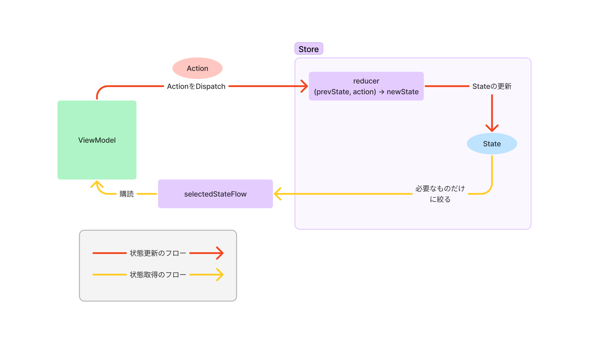

# Android Flux Practice

Flux アーキテクチャでカウンターを実装してみた。

アプリの機能は以下の二つ。

- "+" / "-" ボタンを押すことでカウンターを増やすことができる。
- "toggle enabled" ボタンを押すことでカウンターを増やせないようにしたり元に戻したりできる。


## ディレクトリ構成

```
me.tbsten.prac.flux
    counter ... CounterStore関連
    flux ... Fluxの基本的なクラスを提供する。他のパッケージに依存しない。
    home ... ホーム画面の実装
```

## 詳細

アーキテクチャの概要は以下の図を参照のこと。



### Step.1 Storeの準備

データ層の各機能はFluxの重要な要素である `Action` と `Store` と Storeで保持するデータを表す `State`
の3つを定義することで実装する。
Storeは FluxStore<State, Action> の形で定義することで、後述するユーティリティを使用することができる。

```kt
// Action
sealed interface XXXAction {
    data class ActionA(val hoge: String) : XXXAction
    data object ActionB : XXXAction
}

// State
data class XXXState(
    val hoge: String,
    val fuga: Int,
) {
    companion object {
        val Initial = XXXState(
            hoge = "",
            fuga = 0,
        )
    }
}

// Store
class XXXStore : FluxStore<XXXState, XXXAction>(XXXState.Initial) {
    override fun reducer(prevState: CounterState, action: CounterAction): CounterState =
        when (action) {
            // ...
        }
}
```

- Actionはsealed classを使うことでActionCreatorと呼ばれるFluxの概念を取り入れる必要がなくなる。(
  データクラス等のコンストラクタがActionCreatorの役割を担うため)
- XXXStateはプレーンなdata classとして定義するのが良さそう。またStoreのコンストラクタに渡すためにInitialという名前で初期値を定義しておくと便利だろう。
- Storeはクラスとして定義するため、dagger
  hilt等でインスタンスのスコープを管理することもできる。(
  実装が複雑になるため、本サンプルでは `me.tbsten.prac.flux.Singletons.kt`
  にグローバル変数に代入するにとどめてある)

Storeではreducerメソッドをオーバーライドする必要がある。reducerは変更前のStateとActionを受け取って変更後の状態を返すメソッドで、純粋な関数（副作用がない関数）である必要がある。
多くの場合、Actionのタイプを識別して変更前のStateをcopyして一部改変すると言った処理になるだろう。

```kt
class XXXStore : FluxStore<XXXState, XXXAction>(XXXState.Initial) {
    override fun reducer(prevState: CounterState, action: CounterAction): CounterState =
        when (action) {
            is XXXAction.ActionA -> prevState.copy(hoge = action.hoge)
            XXXAction.ActionB -> prevState.copy(fuga = prevState.fuga + 1)
        }
}
```

- whenの条件ごとの処理の内容が複雑になる場合は別途privateなメソッドを生やしてそこに詳細を書くと良さそう。
- もし状態を変更しない場合は prevStateを返すと良い。無駄に変更が通知されないためである。

### Step.2 UI側での購読

Storeの値を読み取り、UIに反映するには、ViewModelでStoreをstoreを購読する。
その際 `selectedStateFlow` を使って必要なものだけ購読するようにすると良いだろう。

```kt
class HomeViewModel(
    private val xxxStore: XXXStore,
) : ViewModel() {
    val hoge = selectedStateFlow(xxxStore) { it.hoge }
}
```

selectedStateFlowの戻り値はStateFlowになっているため、あとはComposableでcollectAsStateするなり、Activity,
Fragment等でcollectしてよしなに購読する。

### Step.3 状態の更新

状態の更新はStoreのdispatchメソッドをAction付きで呼び出すことで行う。
複雑な画面ではViewModelで参照するStoreが複数になることも発生すると思うので、ViewModelにそれぞれのstoreのdispatchを委譲するようなメソッドをはやしておこう。

```kt
class HomeViewModel(
    private val counterStore: CounterStore,
) : ViewModel() {
    // ...
    fun dispatchCount(action: CounterAction) = counterStore.dispatch(action)
}
```

これで、Step.1でStore定義時にoverrideしたreducerがよしなに呼び出され、状態が更新される。

## Next

- 一般的なアプリ開発に必要な非同期処理を挟むための仕組みが必要。
- 共通処理を挟むためのミドルウェアの仕組みを整えるとより利便性が上がりそう。
    - 例えばローディングやダーティーフラグの管理などを共通化することができるだろう。
- JSの状態管理ライブラリの多くでは Storeの状態を永続化するユーティリティが用意されているものも多い。
  kotlinx.serialization等を活用し、うまいこと永続化をライブラリ側に閉じ込めることができると非常に便利だろう。
